# リポジトリの作成
GitHub上でマイページの"Repositories"タブに移動し, "New"をクリックする.

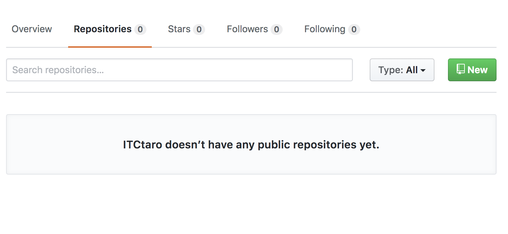

"Repository name"に任意の名前を入力し(今回の場合は"hello-git"), "Create repository"をクリックする.

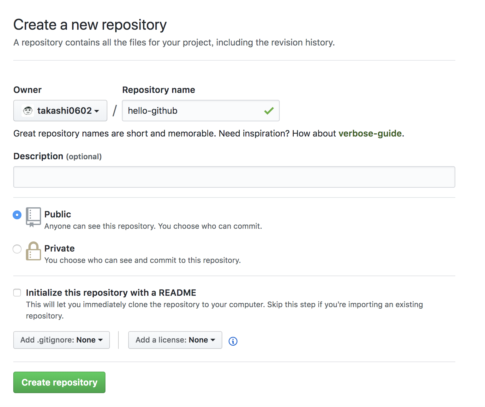

以下のような画面が出たら成功である.

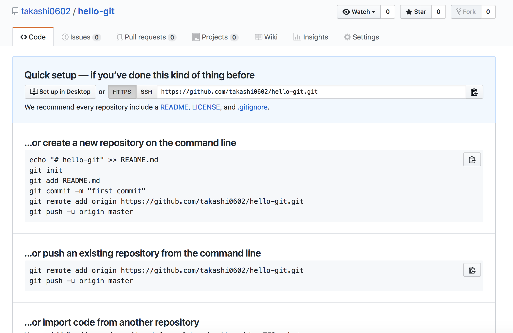

# ローカルリポジトリに追加

まずはGitHubにて, リモートリポジトリのURLをコピーする.  
リポジトリの画面の右側にある"Clone or download"を押し, 表示されたURLをコピーする.

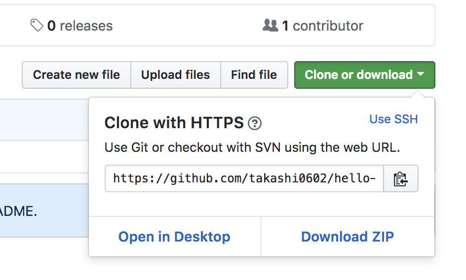

次に, ローカルリポジトリにリモートリポジトリを追加する.  
これにより, 後述するpushやpullなどの作業を簡単に行えるようになる.

ターミナルで下記のコマンドを実行すると, ローカルリポジトリに対してリモートリポジトリが`origin`という名前で登録される.  
ちなみに, `origin`以外の名前を付けても良いが, 慣習的に`origin`と付けられることが多い.

```bash
$ git remote add origin <リモートリポジトリのURL>
```

ローカルリポジトリに登録されているリモートリポジトリの名前やそれに対応するURLを確認する場合は,

```bash
$ git remote -v
origin https://github.com/takashi0602/hello-git.git (fetch)
origin https://github.com/takashi0602/hello-git.git (push)
```

とコマンドを入力し, 実行する.  
実行結果が上記のようになれば成功である.

# pushする
pushと呼ばれる操作を行うことで, ローカルリポジトリの変更内容をリモートリポジトリに反映させることができる.  
先程作成した`hello.txt`はコミットまでされているので, 次はこれをpushする.  
pushする際は`git push`の後に続けてリモートリポジトリの名前(今回は`origin`), push先ブランチ名(今回は`master`)を入力する.

```bash
$ git push origin master
Counting objects: 3, done.
Writing objects: 100% (3/3), 244 bytes | 244.00 KiB/s, done.
Total 3 (delta 0), reused 0 (delta 0)
To https://github.com/takashi0602/hello-git.git
   9678fb4..52e8275  master -> master
```

上記のような実行結果が表示されれば成功である.

GitHub上でリポジトリを確認すると, hello.txtが反映されていることが分かる.


# pullする
pullと呼ばれる操作を行うことで, リモートリポジトリでの変更内容ををローカルリポジトリに反映させることができる.

基本的にGitHub上で作業することは無いが, 今回は擬似的にリモートリポジトリに変更があった状況を作り出すため, GitHub上で直接`hello.txt`の内容を変更する.

`hello.txt`を開き, 画面右側にある鉛筆のアイコンを選択し, ファイルを編集する.


今回は`hello, github!!!`と入力する.

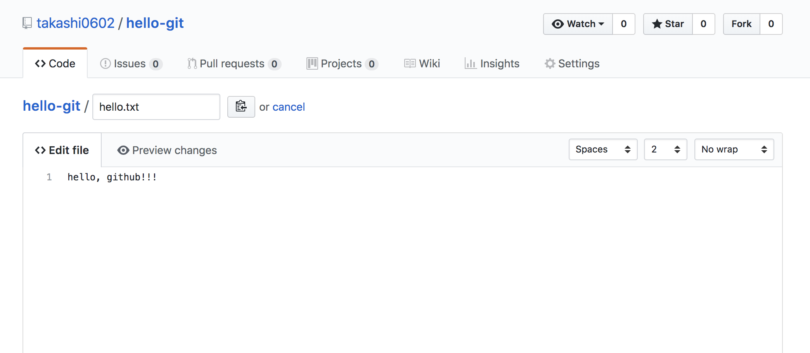

画面上でコミットを作成する.  
"Commit changes"ボタンをクリックすると変更が確定される.

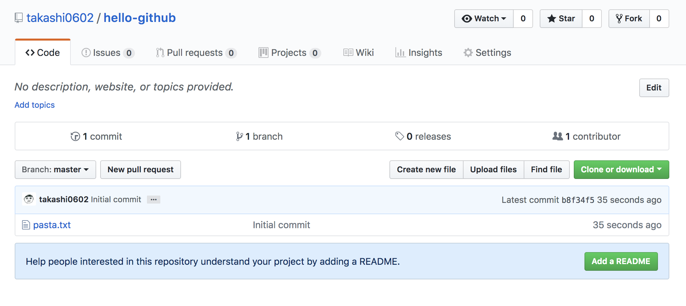

変更された内容をpullしてローカルリポジトリにも反映させる.

```bash
$ git pull origin master
remote: Counting objects: 3, done.
remote: Total 3 (delta 0), reused 0 (delta 0), pack-reused 0
Unpacking objects: 100% (3/3), done.
From https://github.com/takashi0602/hello-git
 * branch            master     -> FETCH_HEAD
   52e8275..4acdde3  master     -> origin/master
Updating 52e8275..4acdde3
Fast-forward
 hello.txt | 1 +
 1 file changed, 1 insertion(+)
```

# forkする
誰かがGitHub上に公開しているリポジトリを自分のGitHub上に複製することをforkと呼ぶ.

今回は[hello-github](https://github.com/takashi0602/hello-github)をforkする.  
右上にある"Fork"ボタンをクリックする.

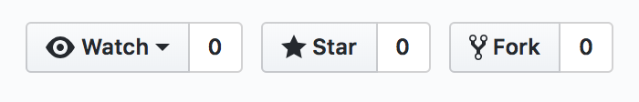

forkするユーザを選択する.


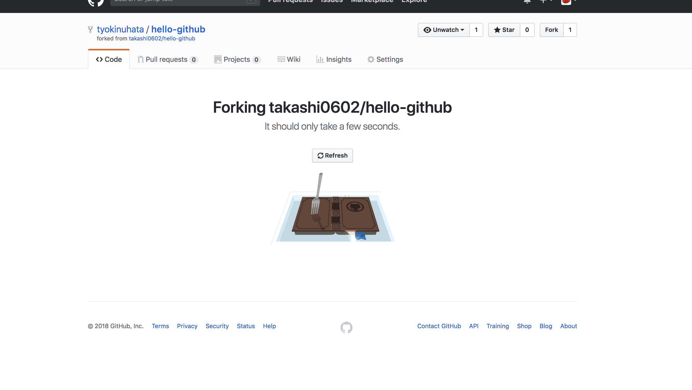

forkが完了すると, リポジトリ名の下部に"forked from takashi0602/hello-github"とfork元リポジトリが記載される.

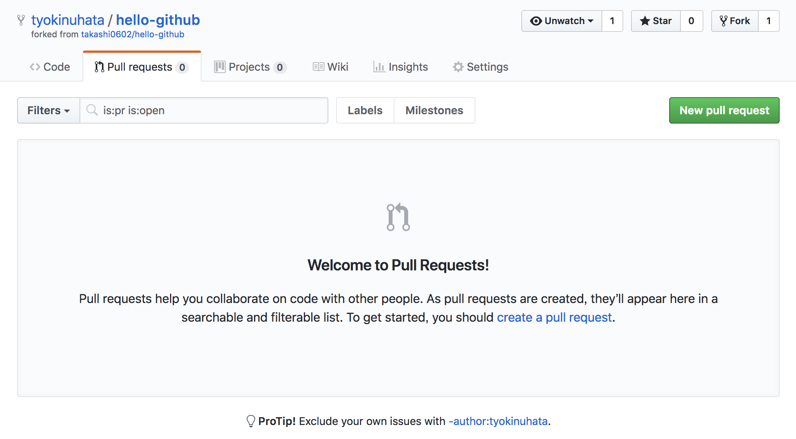

# cloneする
誰かがGitHub(など, インターネット上)に公開したリポジトリを自分のPCに複製(ダウンロード)することをGitではcloneと呼ぶ.  
cloneするときは"Clone or Download"をクリックし, URLをコピーする.  

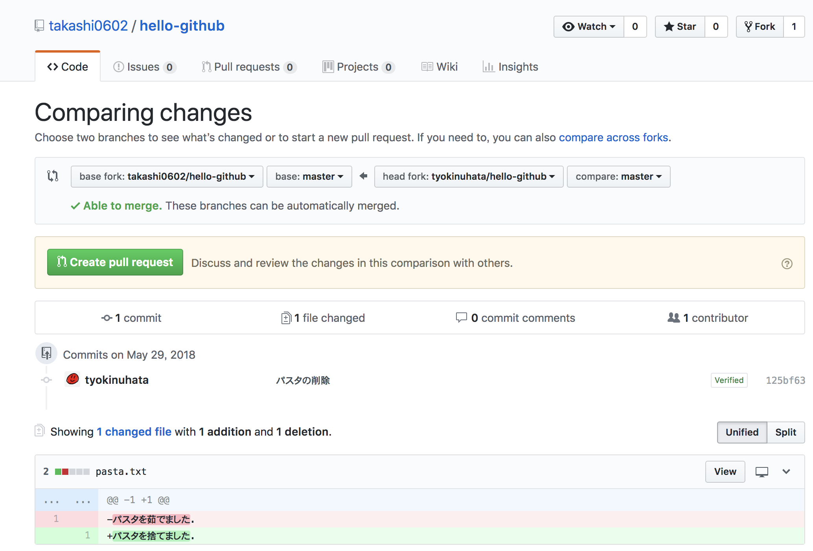

また, cloneする場所はhello-git内ではないので, `cd`コマンドを使用して一つ上の階層に移動する.  

```bash
$ cd ..
```

移動できたら, ターミナルやGit Bashで以下のコマンドを入力する.

```bash
$ git clone https://github.com/ユーザ名/hello-github.git
```

これでcloneが完了した.

# Pull Requestの作成
Pull Requestは自分のローカルリポジトリでの変更をコミットし, リモートリポジトリにpush後, その変更をfork元のリポジトリに取り込んでもらいたい時に使う機能である.  
プルリクやPRと省略されて呼ばれることが多い.

まずは先程cloneしたリポジトリに移動する.

```bash
$ cd hello-github
```

コミットするにはリポジトリに変更を加える必要があるため, 今回は`学籍番号.txt`(例: `B7233.txt`)という名前のファイルを作成する.  
その後, ステージングとコミットを行い, pushする.

```bash
$ touch B7233.txt
$ git add .
$ git commit -m "add B7233.txt"
$ git push origin master
```

ここからが本題で, いよいよPull Requestを作成する段階に入る.  
GitHubに移動し, "Pull requests"タブを選択し, "New pull request"ボタンをクリックする.


次に, "Create pull request"ボタンをクリックする.


すると, Pull Requestの作成画面が出るので, Pull Requestのタイトルとその説明を適当に入力し, 右下にある"Create pull request"をクリックする.


そうすると, pull requestが作成される.


# mergeする
mergeはPull Requestの内容をリモートリポジトリに反映させるために使用する機能である.

まず, "Pull Requests"タブを選択肢, mergeしたいPull Requestを選択する.  
そして, "Merge pull request"ボタンをクリックする.

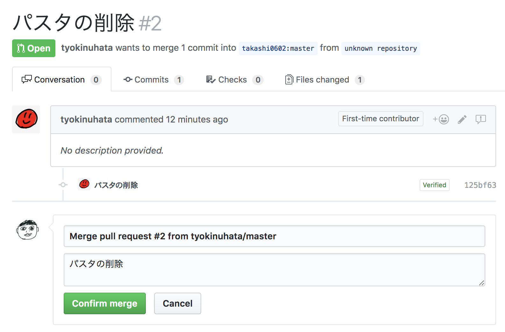

クリック後, 適当なメッセージを入力して"Confirm merge"ボタンをクリックすると, mergeが完了する.

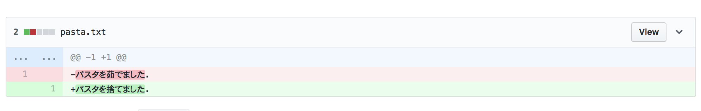

また, mergeが完了すると, Pull Requestの状態が"Open"から"Merged"に変更され, 色調も緑色から紫色に変更される.

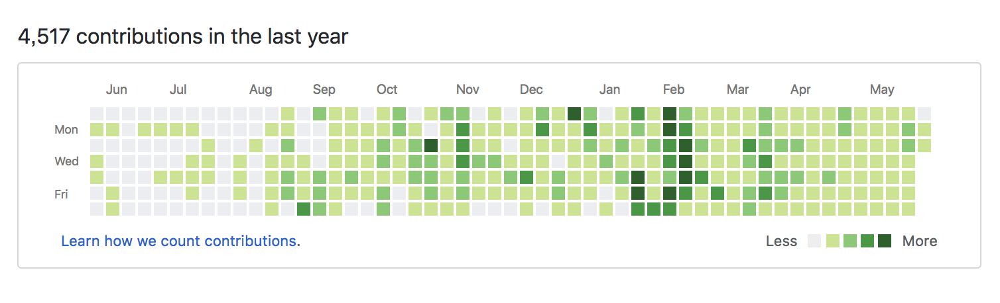

# issueの作成
issueは日本語で「問題」や「課題」を指す言葉で, プロジェクトで発生したバグや新機能・改善点等の要望をissueとして一元管理することでプロジェクトの見通しを良くするための機能である.

新たにissueを作成する際は"New issue"をクリックする.

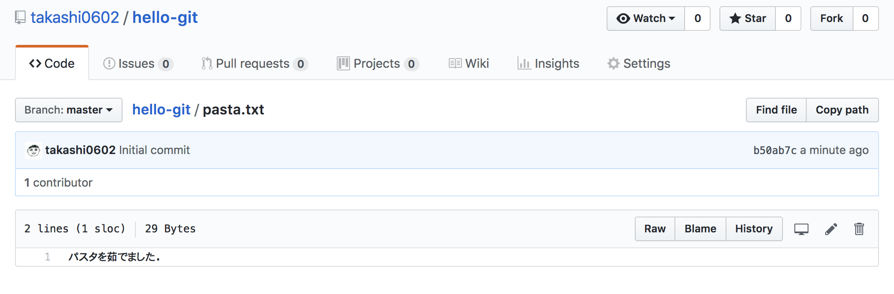

そして, issueのタイトルとその説明を記述し, "Submit new issue"をクリックすることでissueが作成される.

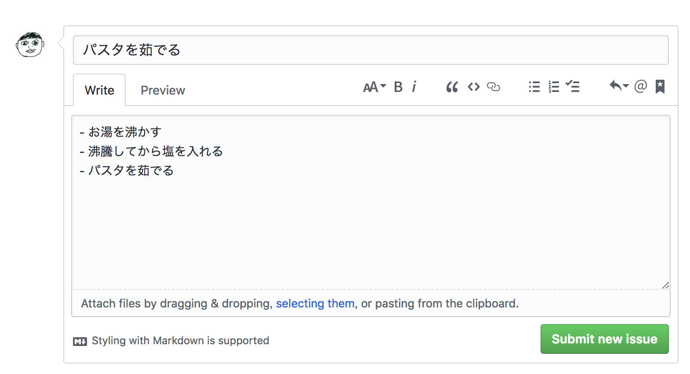

このとき, 右側にある"Assignees"からissueの担当者を割り当てることができたり, 同じく右側にある"Labels"からissueの分類をすることもできる.

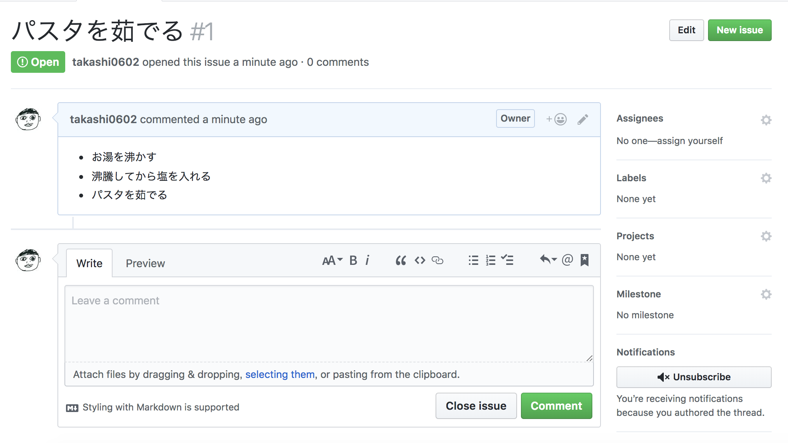

# .gitignore
`.DS_Store`や`Thumbs.db`といったファイルシステムによって自動生成されるファイルや, `node_modules`のようなモジュール, `.vscode`や`.idea`のようなエディタが生成するファイルはGitの管理下に置く必要は無い.  
そのようなファイルやディレクトリを.gitignoreに記述することで, Gitの監視下から除外することができる.

例えば, hoge.txtをGitの管理下から除外したい場合, まず.gitignoreファイルを作成する.

```bash
$ touch hoge.txt
$ touch .gitignore
```

次に, `.gitignore`に`hoge.txt`と書き込む.
echoコマンドと`>`の詳しい説明は省略するが, これで`.gitignore`に`hoge.txt`と書き込んでいる.

```bash
$ echo hoge.txt > .gitignore
```

上記のようにすることで, ステージングしても`hoge.txt`はステージングされないことが分かる.

```bash
$ git add .
$ git status
```
