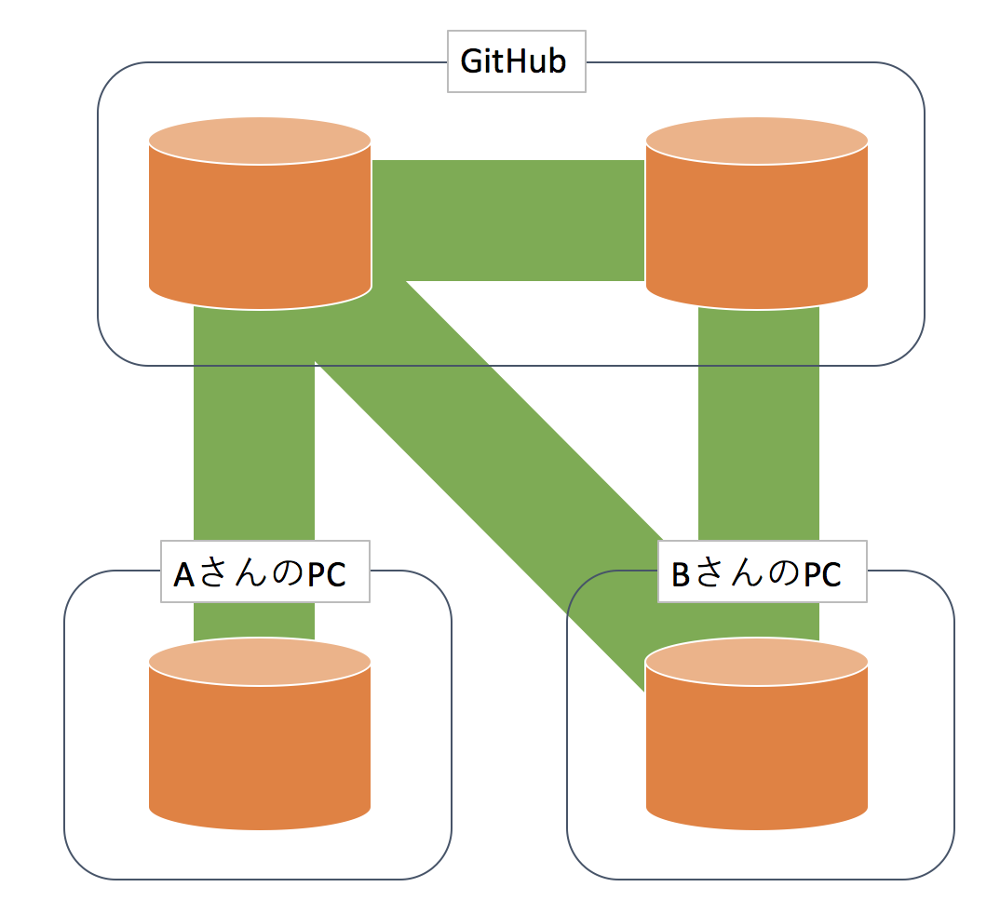

# Gitとは

**Git**はソースコードをリポジトリと呼ばれる１つのまとまりとして変更履歴を記録・追跡できる**分散型バージョン管理システム**である.  
元々はLinuxカーネルのソースコードを管理するためにリーナス・トーバルズによって開発された.

### Gitを使わずに開発するとどうなるか

Gitなどのバージョン管理システムを使わずに開発すると, 主に以下のような問題が発生する.

- 様々なバージョンのプロジェクトが散乱し, どれが最新版か分からない
- コードの変更箇所を容易に元に戻せない
- 誰がどこのコードを変更したのか特定できない

これらの問題を解決するGitは個人開発でも十分に役立つが, チーム開発でその真価を発揮するため, 是非とも２年後期から始まる「システム開発演習」では導入していきたい.

### Gitが生まれる以前の話
Gitが生まれる以前は**CVS**や**Subversion**をはじめとするバージョン管理システムが使用されていたが, これらのツールはいずれも「**集中型バージョン管理**」という方式を取っていたため, リポジトリが置かれたサーバに接続できない環境では最新のソースコードを取得やファイル編集の反映ができないなど様々な問題が生じた.

Gitはこれを解決するために「**分散型バージョン管理**」という方式を取り, それらの欠点を克服した.  

# GitHubとは

**GitHub**はGitのリポジトリをホスティングするためのサービスである.  
つまり, 自分がローカル環境で作ったGitリポジトリを簡単にインターネット上で公開したり, 他人と共有したりできるサービスである.  
同様のサービスにGitLabやBitBucketなどがある.  
これらのサービスが存在するおかげで, 我々は自分でGitサーバを作ることなしに手軽にGitリポジトリを公開することができる.

# Git/GitHubのおおまかなイメージ

上図のそれぞれのリポジトリは,

ローカルリポジトリ ... AさんのPC内にあるGitリポジトリ, BさんのPC内にあるGitリポジトリ  
リモートリポジトリ ... AさんのGitHub上にあるGitリポジトリ, BさんのGitHub上にあるGitリポジトリ

の二種類に分類することができる.  

これらのリポジトリは, 互いに様々な操作を通じてやり取りを行う.  
例えば, リモートリポジトリでのファイルの変更をローカルリポジトリに取り込んだり, ローカルリポジトリでのファイルの変更をリモートリポジトリへ反映するなどである.  
これらのリポジトリ間のやり取りに関しては４章から順に解説する.
