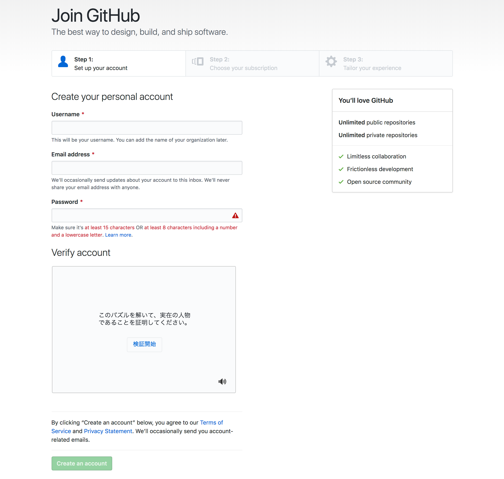

# GitHubの登録
それでは, GitHubのアカウントを作成する手順を説明する.  

まずは[GitHub](https://github.com/)にアクセスし, すでにアカウントを持っている人は右上からサインイン, 持っていない人はテキストボックスに何も入力せず, "Sign up for GitHub"をクリックする.

ユーザ名, メールアドレス, パスワードを入力し, "Verify account"でアカウントが正しいことを検証し, "Create an account"をクリックする.

次に, "Free"(フリープラン)にチェックを入れ, "Continue"をクリックする.  
ちなみに, プライベートリポジトリを無制限に作成できる学生プランも用意されているので, 学生の間に[GitHub Education](https://education.github.com/)で申請を行っておくと良い.  
プライベートリポジトリとは, 限られたメンバーのみが閲覧可能なリポジトリのことで, 外部に公開される通常のリポジトリはパブリックリポジトリ(または単にリポジトリ)と呼ばれる.

最後に, アンケートに答えることができるが, "skip this step"をクリックするとアンケートをスキップすることも可能である.

アカウントの作成に成功すると以下のようなページが表示される.

